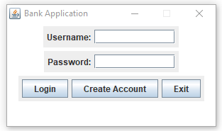
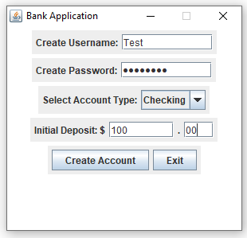

# Banking Application

## Project Introduction

Our project is a banking application that allows users to create an account from which they can deposit and withdraw money, transfer money to a different account, and view their transactions.
The project is coded in Java and utilizes the Swing API to deliver the application in an easy to use graphical user interface.

## Prerequisites

You will need a way to run the program which is written in Java. We recommend an IDE such as Eclipse for this purpose.

## Installation

1. Clone the project repository to your local machine. (https://github.com/UPenn-CIT599/final-project-team-217.git)
2. Run the file BankAppRunner.java in your IDE to launch the application.

## Using Application

When the user runs the program, the first window they will see is the login GUI.  

They will then have the option of logging in with an existing account or creating a new account. For demonstration purposes, we will create a new account first by clicking on the "Create Account" button. The new window that will pop up is the create account GUI. The user must now enter a username and password, pick an account type (checking vs. savings), and put an initial deposit into their account.  

