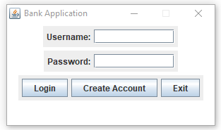
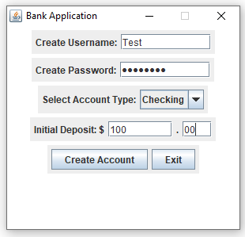
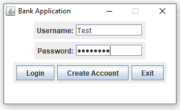
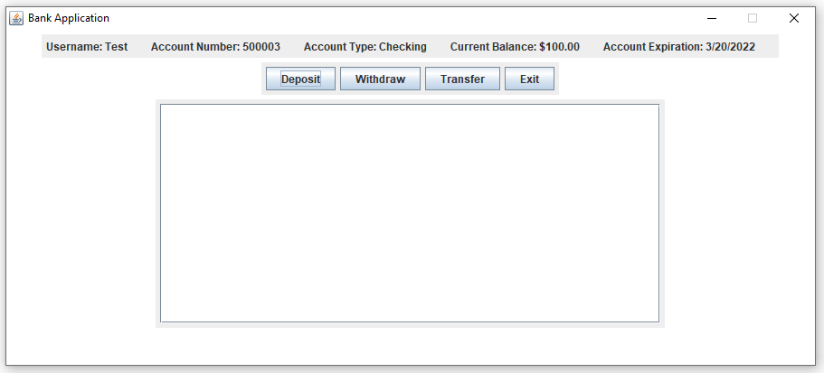
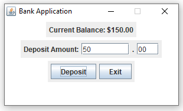
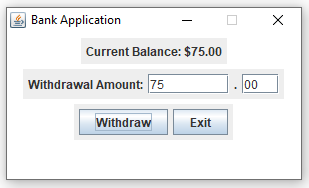

# Bank Account Manager
## Project Introduction

Our project is a banking application that allows users to create an account from which they can deposit and withdraw money, transfer money to a different account, and view their transactions.
The project is coded in Java and utilizes the Swing API to deliver the application in an easy to use graphical user interface.

## Prerequisites

You will need a way to run the program which is written in Java. We recommend an IDE such as Eclipse for this purpose.

## Installation

1. Clone the project repository to your local machine. (https://github.com/UPenn-CIT599/final-project-team-217.git)
2. Run the file BankAppRunner.java in your IDE to launch the application.

## Using Application

When the user runs the program, the first window they will see is the login GUI.  

They will then have the option of logging in with an existing account or creating a new account. For demonstration purposes, we will create a new account first by clicking on the "Create Account" button. The new window that will pop up is the create account GUI. The user must now enter a username and password, pick an account type (checking vs. savings), and put an initial deposit into their account.  

Once you have successfully created an account, you will be returned to the login GUI where you can login by entering the username and password for the account you created and clicking the "Login" button.  

Once you have succesfully logged in, you wil be directed to the home page GUI which contains the key information for your account (account number, username, balance, etc.) and options to either deposit money into your account, withdraw money from your account, transfer money to a different account, and exit the application. You will also see a list of all transactions associated with your account.  

To deposit money into your account, click the "Deposit" button. The deposit GUI will open in which the user will enter the amount of money they wish to deposit. Once the amount is entered and the "Deposit" button is clicked, the balance is adjusted to account for the deposited money as shown (The initial balance of $100 is now $150 after the $50 deposit). Once you are done depositing money into your account, click the "Exit" button to return to the home page GUI. The balance will also be adjusted here to account for any deposited money.  

To withdraw money from your account, click the "Withdraw" button. The withdrawal GUI will open in which the user will enter the amount of money they wish to withdraw. Once the amount is entered and the "Withdraw" button is clicked, the balance is adjusted to account for the withdrawn money as shown (The balance of $150 is now $75 after the $75 withdrawal). Once you are done withdrawing money into your account, click the "Exit" button to return to the home page GUI. The balance will also be adjusted here to account for any withdrawn money.  

To transfer money from your account to another external account, click the "Transfer" button. The transfer GUI will open in which the user will enter the account number of the account they are transferring money to, the type of account they are transferring to, and amount of money they wish to transfer. Once this information is entered and the "Send" button is clicked, the balance is adjusted to account for the transferred money as shown (The balance of 75 is now $50 after the $25 transfer to account number 500001). Once you are done transferring money from your account, click the "Exit" button to return to the home page GUI. The balance will also be adjusted here to account for any transferred money.  

The transaction list on the home page GUI is also constanly updating with every transaction you make. Since we have just completed a deposit, withdrawal, and transfer, the transaction list update with these three transactions.  

## Built With
* Eclipse - Java IDE used for development
* Swing - Java graphics API used to build grapical user interface

## Authors
Rohan Murthy  
Sridhar Varala

## Acknowledgements
The user npitini from StackOverflow wrote JTextFieldLimit.java which limits the number of characters in a JTextField. This was primarily used to limit the number of characters in the cents JTextField to two.
